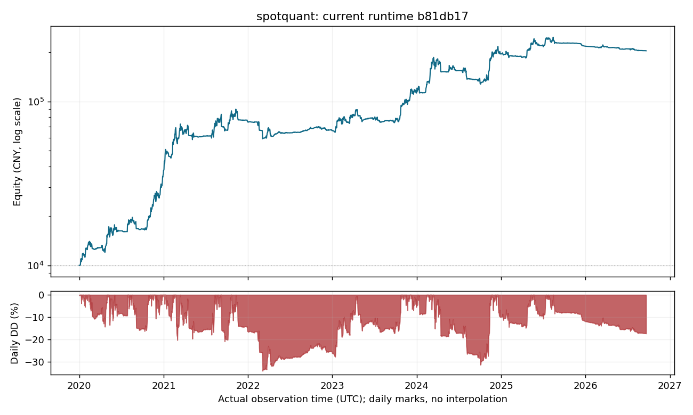

# 当前版本完整回测

2026-10-06（Asia/Shanghai）完成。测量运行代码为 [`b81db17`](https://github.com/geniusgrok/spotquant/tree/b81db17c31a4b1fed8d8fc3d63c9954053a66613)，策略为 **SMA30 / 40 / 50 + ATR stop + crowding entry adjustment**。

| 指标 | 结果 |
|---|---:|
| 初始资金 | 10,000.00 元 |
| 期末人民币权益 | 203,568.00 元 |
| 累计净收益 | 1,935.68% |
| 人民币年化净收益 | 56.60% |
| 人民币路径最大回撤代理 | 36.41% |
| 日观测最大回撤 | 34.06% |
| 实际模拟成交笔数 | 129 |
| 成交手续费 | 1,108.0063 USDT |
| 净支付资金费 | 0.0000 USDT |
| 历史会话 | 795 / 795 |

独立账户以 1 万元启动，不追加或提取资金；UTC 窗口为 **2020-01-01 00:00:00 至 2026-09-20 00:00:00，末端不含**。每次会话 300 秒、轮询 5 秒，读延迟 0.2 秒、写延迟 1 秒。最终持仓按末端价格估值，不为窗口结束强制造成交。始末换汇各扣 0.1%，汇率使用当时已可得的历史参考值；USD/USDT 按平价估值。成交手续费为 0.1%，市价滑点 0.05%，止损滑点 0.1%。

年化采用 `(期末人民币权益 / 10000) ** (1 / 年数) - 1`，每年 365.25 天。人民币指标包含汇率变化。生产者已在完成时核对成交、费用与资金账本，结果通过；本报告直接导出该结果。

图和 [日权益 CSV](backtest/daily-equity.csv) 保留生产者实际观测时间，不填补每日点或重构未记录的账户路径。图中的日观测回撤可能低于表中日内路径最大回撤代理。[机器可读结果](backtest/summary.json) 保留精确资金、测量源码、输入身份、成本和生产者账本核对结果。

使用日 OHLC，并按开盘→最高→最低→收盘线性构造日内价格路径；它不是实际日内成交序列。 回测执行与保护成交均为历史模拟，不能证明交易所真实委托、重启或止损触发能力。该历史窗口曾用于策略开发，因此本结果不构成独立样本外 alpha 或未来收益证明；实际账户观察天数为 0。

模拟中的 `avgPrice` 与模拟现价一致，因而没有覆盖真实最新价快速下跌、均价滞后、撤旧止损后新止损被拒的情形。36.41% 是所述 OHLC 路径的回撤代理，不是真实回撤上界。100% 年化/30% 最大回撤目标均未达到。本报告严格绑定上述 `b81db17` 运行源码，不重标为后续执行修复的测量结果。

原始回执、运行注册与离线方法保存在 [本次回测归档分支](https://github.com/geniusgrok/spotquant/tree/archive/backtest-main-20261006/backtest-source)。main 展示文档的提交不会改变测量源码身份。
